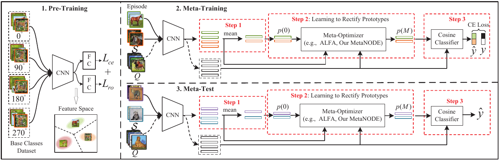

# MetaNODE: Prototype Optimization as a Neural ODE for Few-Shot Learning
This repository contains the code for the paper:
<br>
[**MetaNODE: Prototype Optimization as a Neural ODE for Few-Shot Learning**](https://arxiv.org/abs/2103.14341)
<br>
Baoquan Zhang, Xutao Li, Shanshan Feng, Yunming Ye, Rui Ye
<br>
AAAI 2022
<p align='center'>
  
</p>

### Abstract

Few-Shot Learning (FSL) is a challenging task, \emph{i.e.}, how to recognize novel classes with few examples? Pre-training based methods effectively tackle the problem by pre-training a feature extractor and then predicting novel classes via a cosine nearest neighbor classifier with mean-based prototypes. Nevertheless, due to the data scarcity, the mean-based prototypes are usually biased. In this paper, we attempt to diminish the prototype bias by regarding it as a prototype optimization problem. To this end, we propose a novel meta-learning based prototype optimization framework to rectify prototypes, i.e., introducing a meta-optimizer to optimize prototypes. Although the existing meta-optimizers can also be adapted to our framework, they all overlook a crucial gradient bias issue, i.e., the mean-based gradient estimation is also biased on sparse data. To address the issue, we regard the gradient and its flow as meta-knowledge and then propose a novel Neural Ordinary Differential Equation (ODE)-based meta-optimizer to polish prototypes, called MetaNODE. In this meta-optimizer, we first view the mean-based prototypes as initial prototypes, and then model the process of prototype optimization as continuous-time dynamics specified by a Neural ODE. A gradient flow inference network is carefully designed to learn to estimate the continuous gradient flow for prototype dynamics. Finally, the optimal prototypes can be obtained by solving the Neural ODE. Extensive experiments on miniImagenet, tieredImagenet, and CUB-200-2011 demonstrate the effectiveness of the proposed method.

### Citation

If you use this code for your research, please cite our paper:
```
@inproceedings{zhang2021metanode,
	author    = {Zhang, Baoquan and Li, Xutao and Feng, Shanshan and Ye, Yunming and Ye, Rui},
	title     = {MetaNODE: Prototype Optimization as a Neural ODE for Few-Shot Learning},
	booktitle = {AAAI},
	year      = {2022}
}
```

## Code is Coming Soon

